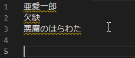
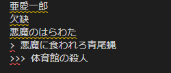
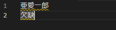

# Kyujify - Japanese Character Converter

[](https://marketplace.visualstudio.com/items?itemName=Ishizue.kyujify)
[](https://marketplace.visualstudio.com/items?itemName=Ishizue.kyujify)

Convert between modern Shinjitai (新字体) and historical Kyūjitai (旧字体) Japanese characters directly in VS Code.

## Features

- ➡️ Bidirectional conversion between Shinjitai and Kyūjitai
- 🎯 Convert selections or entire documents
- 🛡️ Exclusion list for protected characters/words
- ✨ Line-specific conversion using prefix symbols
- 📥 450+ built-in character pairs ([source](https://github.com/DrTurnon/kyujipy/blob/master/kyujipy/data/kyujitai_simplified.cson)) 
- 📦 Custom pair overrides support

## Installation

1. Open **Extensions** view (`Ctrl+Shift+X`)
2. Search for "Kyujify"
3. Click **Install**
4. Reload VS Code

## Usage

**Basic Conversion:**
- Right-click menu: "Convert to Kyūjitai" / "Convert to Shinjitai"
- Command Palette (`Ctrl+Shift+P`):
  - `Kyujify: Convert to Kyūjitai`
  - `Kyujify: Convert to Shinjitai`
- Keyboard shortcuts (configure in settings)

**Selection Rules:**
- Converts entire document when no text is selected
- Converts only selection when text is highlighted



## Configuration

This extension contributes the following settings:

* `kyujify.exclusions`: List of words to exclude from conversion, e.g. ["欠缺"]
* `kyujify.lineStartSymbol`: Symbol that indicates a line should be converted. Leave blank to convert all text. Can be a string, e.g. ">",
* `kyujify.conversionPairsFile`: Path to the JSON file containing conversion pairs. You can set whatever path, but the default is "./data/default_pairs.json".

## Conversion Data

Default conversion pairs are based on [DrTurnon/kyujipy's kyujitai_simplified list](https://github.com/DrTurnon/kyujipy/blob/master/kyujipy/data/kyujitai_simplified.cson) (MIT licensed). Structure matches the original CSON format:

```
# Example from source data
[
    ["亜", "亞"],
    ["悪", "惡"],
    ["圧", "壓"],
    ["囲", "圍"]
]
```

## Advanced Usage

### Line-Specific Conversion:
Prefix lines with your symbol to convert only those lines:
```
> 聖アレキセイ寺院の殺人事件に法水が解決を公表しなかつたので、そろ〱迷宮入りの噂が立ちはじめた十日目のこと、その日から搜査關係の主腦部は、ラザレフ殺害者の追求を放棄しなければならなくなつた。 (converted)
この書き出しから始まる『黒死館殺人事件』は、小栗虫太郎による長編探偵小説であり、日本探偵小説の「三大奇書」の一つとも称される。 (unconverted)
```



### Exclusion Protection:
Preserve specific combinations during conversion:
```
// kyujify.exclusions = ["欠缺"]
欠缺 -> remains 欠缺 (instead of 欠欠 or 缺缺)
```



## Known Issues

[Kakikae](https://ja.wikipedia.org/wiki/%E5%90%8C%E9%9F%B3%E3%81%AE%E6%BC%A2%E5%AD%97%E3%81%AB%E3%82%88%E3%82%8B%E6%9B%B8%E3%81%8D%E3%81%8B%E3%81%88) is planned but not supported yet.

## Release Notes

### 1.0.0

Initial release

## License
MIT (Conversion data derived from [kyujipy](https://github.com/DrTurnon/kyujipy) by DrTurnon, MIT licensed)